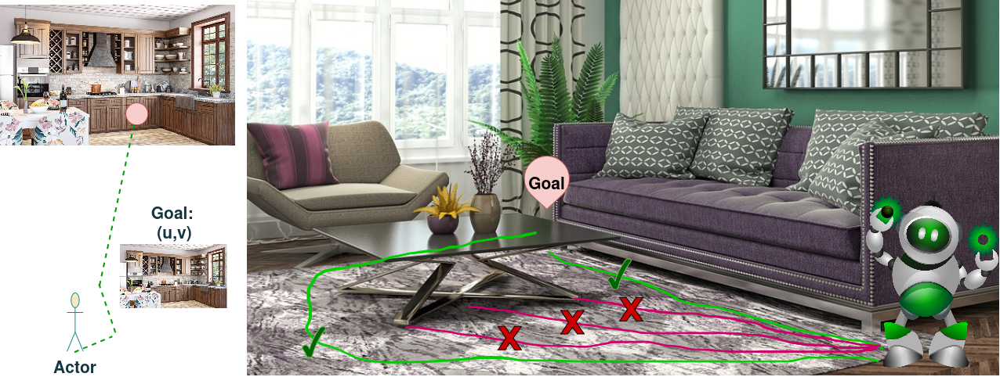

# SSM-PixNav: State Space Models for Pixel-Guided Embodied Navigation

<p align="center">
  
</p>

## SSM-PixNav: State Space Models for Pixel-Guided Embodied Navigation

This repository contains the official implementation of **SSM-PixNav**, a State Space Model (SSM)-based framework for pixel-guided embodied navigation.

Pixel-guided navigation enables an embodied agent to navigate toward a target specified by a single image observation rather than semantic labels or object categories. Existing approaches primarily rely on Transformer-based sequence modeling, which can become computationally expensive when processing long visual trajectories. SSM-PixNav investigates whether modern State Space Models can provide a more efficient and scalable alternative for embodied navigation while maintaining strong navigation performance.

Our approach replaces the Transformer policy backbone with a State Space Model architecture, enabling efficient long-horizon temporal reasoning over visual observations. We evaluate the method in Habitat environments under both seen and unseen scenes and compare against existing Pixel Navigation baselines.

This is the official implementation of the paper. Please refer to the paper for detailed methodology, experiments, and analysis.

---

## Features

* State Space Model policy for pixel-guided navigation
* Efficient long-horizon trajectory modeling
* Habitat-Sim and Habitat-Lab support
* Evaluation on HM3D and MP3D environments
* Support for pretrained checkpoints
* Reproducible benchmarking pipeline

---

## Dependencies

Our implementation is based on Habitat-Sim and Habitat-Lab.

Please install:

* Python >= 3.10
* PyTorch
* Habitat-Sim
* Habitat-Lab
* NumPy
* OpenCV
* tqdm
* torchvision
* einops
  

Make sure the following datasets are downloaded and configured correctly:

* HM3D
* Matterport3D (MP3D)
* Pixel Navigation episode datasets

---

## Installation

Clone the repository:

```bash
git clone https://github.com/<username>/SSM-PixNav.git
cd SSM-PixNav
```

Create environment:

```bash
conda create -n ssm_pixnav python=3.10
conda activate ssm_pixnav
```

Install dependencies:

```bash
pip install -r requirements.txt
```

Install Habitat:

```bash
pip install habitat-sim
pip install habitat-lab
```


## Metrics

We report standard embodied navigation metrics:

* Success Rate (SR)
* SPL
* Distance-to-Goal (DTG)
* SoftSPL
* Episode Length

---

## Results

HM3D Evaluation Results

| Method | Easy SR | Medium SR | Hard SR |
|----------|----------|----------|----------|
| RGB PixNav Baseline | 0.3676 | 0.1739 | 0.1726 |
| SSM-RGB PixNav | 0.7545 | 0.3091 | 0.2000 |
| Causal SSM-RGB PixNav | 0.8043 | 0.4808 | 0.2273 |
| RGBD PixNav | 0.5361 | 0.3571 | 0.1500 |
| SSM-RGBD PixNav (Mamba) | 0.5736 | 0.2987 | 0.1900 |
| Causal SSM-RGBD PixNav | 0.6894 | 0.3160 | 0.3000 |

---
## Dataset

Dataset will be uploaded to zenodo link. Link will be updated soon.
## Acknowledgements

This project builds upon:

* Habitat-Sim
* Habitat-Lab
* Pixel Navigation

We thank the authors of these projects for making their code and datasets publicly available.
We thank the reviewers for the insightful comments that helped shape the work better.

---

